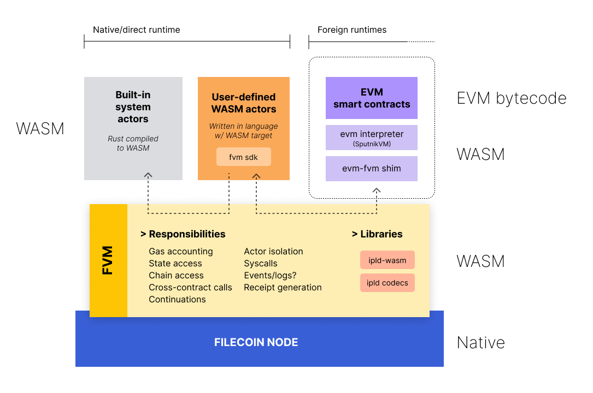
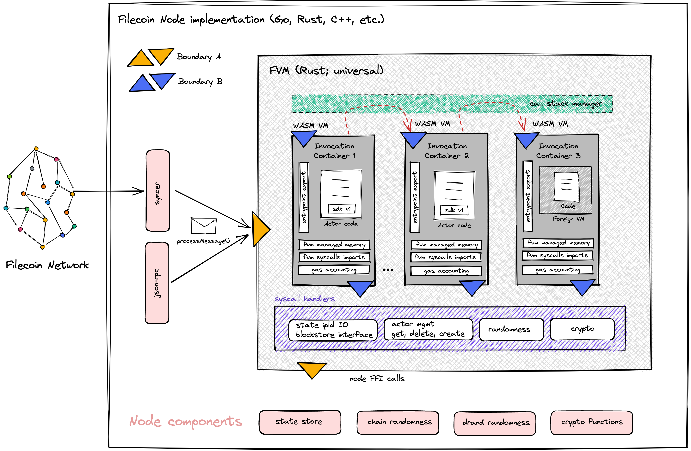
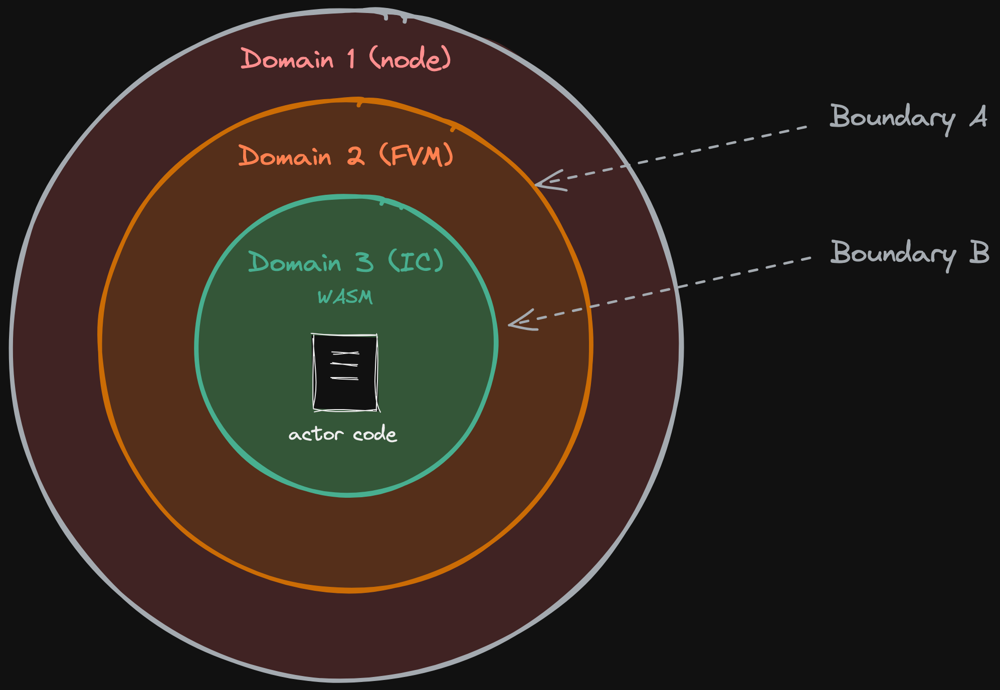
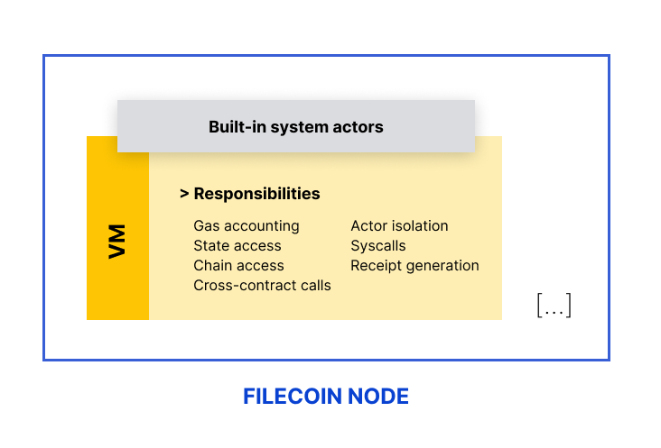

# Filecoin VM architecture

> v0, early October 2021
> Authors: @raulk, @stebalien.
> Contributors: @expede, @aronchick, @bmann

This documents provides an overview of the architecture of the FVM, including a small summary of the current VM as an annex at the end.

<!-- START doctoc generated TOC please keep comment here to allow auto update -->
<!-- DON'T EDIT THIS SECTION, INSTEAD RE-RUN doctoc TO UPDATE -->
**Table of Contents**  *generated with [DocToc](https://github.com/thlorenz/doctoc)*

- [Overview](#overview)
  - [Native user-defined actors](#native-user-defined-actors)
  - [Foreign user-defined actors](#foreign-user-defined-actors)
  - [Built-in system actors](#built-in-system-actors)
- [Execution architecture](#execution-architecture)
  - [FVM](#fvm)
  - [Invocation Container (IC)](#invocation-container-ic)
  - [Domains and boundaries](#domains-and-boundaries)
  - [FVM syscalls](#fvm-syscalls)
  - [FVM SDK](#fvm-sdk)
- [Actor public interface](#actor-public-interface)
- [IPLD everything](#ipld-everything)
- [State access](#state-access)
- [Actor deployment](#actor-deployment)
- [Call patterns](#call-patterns)
- [Gas accounting](#gas-accounting)
- [JSON-RPC API](#json-rpc-api)
- [Interoperability with other networks](#interoperability-with-other-networks)
- [Formal verifiability](#formal-verifiability)
- [Upgradability opportunities](#upgradability-opportunities)
- [Annex: Current VM](#annex-current-vm)

<!-- END doctoc generated TOC please keep comment here to allow auto update -->


## Overview



The FVM aims to (a) support a multitude of programming models for actors and (b) facilitate the onboarding of smart contracts and programs written for other environments, so they can leverage the storage capabilities of the Filecoin network.

The architecture is largerly inspired by [VM hypervisors](https://en.wikipedia.org/wiki/Hypervisor) and the [actor model](https://en.wikipedia.org/wiki/Actor_model), amongst others paradigms.

## Actors

The term _Actor_ is a reference to the [actor model](https://en.wikipedia.org/wiki/Actor_model), a concurrent computation paradigm that inspires Filecoin's runtime and scalability primitives.

We distinguish three types of actors:

1. Native user-defined actors: targeting the FVM at development time.
2. Foreign user-defined actors: originally targeting another runtime (e.g. EVM) at development time. Likely named "smart contracts" in their original context.
3. Built-in system actors: existing as of today.

### Native user-defined actors

The native FVM runtime is WebAssembly (WASM), and users can technically write actors in any programming that compiles to WASM.

However, there are language-specific overheads that users need to be aware of (e.g. runtime, garbage collection, stdlibs, etc.) They affect the WASM output leading to bloated WASM bytecode and inefficient execution. There will be on-chain code size limits to consider too.

Rust is our primary language recommendation for writing efficient user-defined actors. Hence, the reference FVM SDK is built in Rust.

Exploration of other languages is something we encourage the community to pursue.

### Foreign user-defined actors

The platform-agnostic, hypervisor-inspired architecture of the FVM makes it possible to deploy code targeting foreign runtimes.

Our initial priority is the EVM: we aim to support deploying EVM bytecode as-is to the Filecoin network. We will adopt [SputnikVM](https://github.com/rust-blockchain/evm), a Rust EVM interpreter compatible with WASM runtimes, and will shim the Ethereum network specific behaviours to Filecoin counterparts.

Admittedly, this is an inefficient solution in terms of performance, but it allows for straightforward and relatively risk-free deployment of existing battle-tested Ethereum smart contracts to the Filecoin network.

The gas accounting will factor in the inefficiency, resulting in more expensive executions. This will incentivise developers to migrate the smart contracts to native FVM actors to attain lower execution costs.

In addition to the EVM, in the future we are keen to support for Agoric SES, Solana's BPF, and other blockchain programming models and paradigms.

We believe that compatibility should be accomplished by translating/emulating the lowest-possible executable output in its source form, rather than dealing with high-level languages using alternative/custom toolchains.

Moreover, this choice enables developers to (re-)use all the tooling available in the source ecosystems, and results in the highest possible execution fidelity/parity, thus reducing technical risks.

Refer to [foreign runtimes](#foreign-runtimes) for more detail.

### Built-in system actors

Built-in system actors will run entirely in WASM space. Their source could will migrate to using the FVM SDK. They will be compiled to WASM, and will ship as static WASM modules bundled in the Filecoin node implementation distributions, probably via in-binary embedding.

System actors will continue to (1) be statically bound to their existing addresses, and (2) evolve through system upgrades. Opportunities for network-directed upgrade mechanisms are in the roadmap.

Note: this plan is dependent on the results from preliminary performance benchmarking of WASM vs. native system actors. If the former underperform by an unacceptable margin, we might be compelled to keep the system actors in native space, and treat them like "precompiled contracts" in other platforms.

**Canonical system actors**

This transition to WASM opens up the opportunity to converge on a single codebase of actors for all Filecoin implementations.

In the past, each team would re-implement actors in their language (although some relied on FFI with Go actors, a slower approach). With FVM, a single codebase can be compiled to WASM (its new portable executable form) and be adopted across all implementations.

We acknowledge this strategy has tradeoffs, but we won't elaborate on them here.

## Execution architecture



### FVM

The FVM is implemented in Rust. It is responsible for:

1. Setting up Invocation Containers, managing their lifetime and stacking. This include setting up the WASM runtime, its managed memory, binding syscalls as host-provided functions, and potentially mapping dynamically-linked libraries (e.g. predefined sdk versions).
2. Serving as a call orchestration layer across actors.
3. Resolving Boundary B syscalls where possible within the FVM.
4. Relaying Boundary B syscalls to Boundary A syscalls where the above is unfeasible.
5. Managing IPLD state tree data, by buffering writes from actors running in ICs until execution succeeds, maintaining caches, optimising access patterns (e.g. optimistic fetches), and more.

### Invocation Container (IC)

The Invocation Container (IC) is the tightly constrained and instrumented environment that runs actor code within the context of a single invocation, in isolation with the rest of the system.

The IC is an instance of a WASM runtime (likely Wasmer) fulfilling the FVM contract. The contract consists of:

1. FVM-defined syscalls available as imported functions.
2. FVM-managed memory. Only statically-sized data such as message CID, epoch, gas limit, due to technical limitations (need to investigate more).
3. Gas accounting and execution halting via WASM bytecode compiler weaving and/or instrumentation.
4. Dynamically-linked "blessed" imported WASM modules (e.g. named FVM SDK versions) to reduce bytecode size.

A direct or indirect recursive or reentrant call to an actor spawns a new IC.

Because the FVM contract may change over time, user-deployed actors must specify an IC version at [`InitActor#LoadActor` time](#actor-deployment).

### Domains and boundaries

There are three logical domains of execution we are concerned with for the purposes of this design doc:

- Domain 1: Node (any language).
- Domain 2: FVM (reference implementation written in Rust).
- Domain 3: Invocation Container running actor code (WASM).

These three domains result in two well-defined domain boundaries that possess different characteristics. We'll call them Boundary A and Boundary B.



**Boundary A: Node \[domain 1] <> FVM \[domain 2]**

This boundary is incurred when:

1. the node initiates the processing of a message by instantiating the FVM, or
2. the FVM calls out to native functions provided by the node to resolve syscalls.

Depending on node's language, this boundary may carry a non-negligible cost. Although admittedly, that cost may be overshadowed by the cost of the operation itself (e.g. if it involves disk IO, or an expensive cryptographic calculation).

Where performance is important, implementors should attempt to resolve most syscalls within domain 2, to avoid traversing Boundary A in order to avoid "death by a thousand cuts"-like performance leaks.

_Lotus opportunity:_ cryptograhic functions related to signatures, proving systems (PoSt, PoRep) and more are implemented in [rust](https://github.com/filecoin-project/rust-fil-proofs), and invoked through the [Filecoin FFI](https://github.com/filecoin-project/filecoin-ffi).

**Boundary B: FVM \[domain 2] <> Invocation Container (WASM) \[domain 3]**

This boundary is incurred every time actor code invokes a syscall. The syscall is first handled by the FVM, which in turn may need to traverse Boundary A to resolve it.

Because the reference implementation of the FVM is written in Rust, and the WASM <> Rust FFI mechanisms are relatively cheap, the cost of this boundary is lower than Boundary A (in the reference implementation).

*Opportunity rust-fil-proofs.* [rust-fil-proofs](https://github.com/filecoin-project/rust-fil-proofs) implements the Filecoin proofs (PoRep, PoSt) and related cryptographic primitives in Rust, for performance reasons. The library is integrated in Lotus via Cgo in is the implementation of the Filecoin storage proofs implemented in Rust for performance rasons. in  is integrated into non-Rust clients via FFI. 

### FVM syscalls

Pre-FVM, the term "syscalls" referred to a predetermined set of cryptographic functions available to built-in system actors, each with an associated gas cost.

- BatchVerifySeals
- ComputeUnsealedSectorCID
- HashBlake2b
- VerifyAggregateSeals
- VerifyConsensusFault
- VerifyPoSt
- VerifySeal
- VerifySignature

Post-FVM, the term "syscall" matches the Unix concept more closely. It represents the fundamental interface between any two execution areas. As such, there are syscalls at both boundaries:

- Boundary A syscall: the fundamental interface between the FVM and the node.
- Boundary B syscall: the fundamental interface between the actor and the FVM.

Examples of post-FVM syscalls are:

- `CurrEpoch()`
- `NetworkVersion()`
- `CurrentBalance()`
- `ResolveAddress()`
- `GetActorCodeCID()`
- `GetRandomessFromBeacon()`
- `GetRandomnessFromTickets()`
- `Send()`
- IPLD state operations (read, write, open, close)
- all the above crypto operations.

Essentially, all methods listed on the current specs-actors [`Runtime` interface](https://github.com/filecoin-project/specs-actors/blob/master/actors/runtime/runtime.go) translate into syscalls.

However, frugality is also a concern. There are opportunities to elide the actual syscall by, for example, mapping static fields as externally-managed WASM memory (e.g. current epoch, network version), or to avoid Boundary A syscalls through caching, optimistic optimisations, or providing the behaviour within the FVM domain.

### FVM SDK

The FVM SDK is a versioned library that makes it easy to write actors for the Filecoin Network. At its core, the SDK is aware of the FVM contract and facilitates interaction of actor code with its environment.

The reference implementation of the FVM SDK is written in Rust.

We envision the SDK to be a stack of our layers, from lowest to highest:

1. Syscall definitions/bindings. These are considered plumbing; most developers won't interact with these, but they're necessary to invoke syscalls.
2. Thin syscall wrappers. These are less horrible counterparts to the low-level syscall bindings that use higher-order types.
3. Higher-level APIs offering elemental abstractions and components, such as the blockstore, IPLD interfaces, internal method dispatch, parameter and call convention packing/unpacking, etc.
4. Libraries on top of the latter that implement IPLD-based data structures, such as ADLs, HAMTs, struct binding to params, annotation-based method dispatch, cross-actor call templating, etc.

Together, (1) and (2) form the basis of the **FVM stdlib**.

We recognise that some libraries within layer (4) may be inefficient to execute in WASM land (such as BigInt arithmetic). We may deal with this by escaping the WASM runtime and translating such operations to syscalls that run in the FVM domain. However, gas accounting becomes difficult in such cases, as we'd have to pollute the gas schedule with specific operations.

We could also add the ability to deploy libraries as on-chain actors; this would lead to a richer development experience and we'd expect collections of reusable libraries to emerge and be deployed on-chain, for others to consume. This is similar to the use cases of the `CALLDELEGATE` opcode in the EVM. But we'd probably tighten the security characteristics by introducing the notion of "capabilities", such that the calling actor can specify exactly what the target can access.

## Actor public interface

We considered two main approaches. Hybrids of these two approaches were also evaluated.

**Approach 1 is external method dispatch.** The actor exports a table of callable methods. The sandbox matches the message to an exported method, either through the `MethodNum` message field, or by interpreting the input parameters string against a calling convention. This is largely how the current VM works today.

**Approach 2 is for actors to expose a single entrypoint and rely on internal method dispatch.** This awards maximal degrees of freedom and sophistication to support techniques such as structural pattern matching, efficient pass-through proxying, interception, and more.

Because internal dispatch will rapidly become boilerplate, the FVM SDK should offer utilities.

Architecturally speaking, Approach 2 is more aligned with the actor model as implemented in the industry (Erlang, Akka, etc.), in which actors interact through single inboxes where messages are deposited.

Approach 2 is simpler, and places no constraints on the sandbox. It is easier to reason about and reduces overall complexity. It's also more performant because the sandbox has no need to analyse the WASM exports table. Evolving actors over time (such as introducing interface changes) is also easier to reason about.

Finally, this approach is readily compatible with VMs that rely on internal dispatch (e.g. EVM), but also stretches to accommodates for VMs that perform outer dispatch.

Approach 2 would render the `MethodNum` field on messages obsolete, as external dispatch is no longer necessary, and all call information would be contained in the input parameters.

We _could_ technically preserve the `MethodNum`, and have actors perform internal dispatch based on that _and_ input parameters. But we believe that's unnecessary cruft, and it breaks the actor-orientation paradigm by carrying over a procedural construct.

Not everything is rosy, though. The main risk with Approach 2 is that the calling convention not explicited, which may lead to proliferation of calling conventions across user-deployed actors. In turn this may result in cognitive overhead and interoperability issues.

An IPLD-based Interface Definition Language should eliminate that concern. 

**Future: IPLD-based IDLs**

IPLD Schemas are good for defining the structure of objects, but they do not help with expressing the interface of behaviours an object can offer (e.g. methods), inputs, and outputs.

Our basic idea is to design an IPLD schema for IDLs; think of [gRPC IDLs](https://grpc.io/docs/what-is-grpc/core-concepts/), [SOAP WSDL](https://www.w3schools.com/xml/xml_wsdl.asp), etc. This schema would be standardised and versioned, and understood by the FVM SDK.

This IDL would not have functions as such, but rather _labelled behaviours_. This is consistent with the actor model, where actors don't expose functions, but they are known to provide behaviours.

Each behaviour would carry an IPLD Schema for the input type and the return value type, an error code enum, and potentially an identifier (which incidentally could be a method number!) to facilitate internal dispatch.

Traditional "overloaded functions" can be represented as distinct labelled behaviours dispatching to the same identifier.

The FVM SDK would offer utilities to pack/generate calls to another actor with their IDL.

_Pseudocode:_

```
import "idls/other-actor.idl.ipld" as actor
from sdk import calls

// Res is typed automatically as Result<Type, Error>
let res = calls.target(actor)
               .call("behaviour")
               .with({ Field2: Value, Field2: [Value1, Value2]})
```

**Test sandbox**

The FVM project will need to ship a test actor sandbox for developers to use during their actor development process.

**Foreign runtimes**

Support for foreign runtimes, such as the EVM, will be introduced by emulating those runtimes over WASM by compiling the respective interpreter to WASM bytecode.

We expect a performance penalty from doing this (the extent of it is to be determined), but this tradeoff is workable in exchange for the highest execution fidelity/parity.

Note that adopting more performant alternatives imply compiling the respective high-level languages (e.g. Solidity) to WASM, which bears additional risks that are undesirable. Doing so would also render usesless tools that operate on their native target bytecode (e.g. auditing tools that analyse EVM bytecode, EVM bytecode inspectors, etc.) Thus we prefer to adopt an approach that allows usage of the full catalogue of preexisting tools to be preserved.

Each foreign runtime will require a shim to translate the storage model, gas accounting, account/address schema, gas metering, cross-actor calls, etc. to the native FVM runtime. The shim will also handle foreign chain/VM constructs by intercepting them and adapting them to the FVM native runtime.

This is the case of logs/events in the EVM, which may be stored in a central EVM logs actor.

## IPLD everything

IPLD stands for Interplanetary Linked Data, "Linked" being the operative word. Filecoin data is highly atomized and linked. As a result, the state of an actor is not contained in a single blob, but it's broken up into many items all of which are linked together through IPLD data structures.

Structs are common data structures, but some ADLs (advanced data layouts) are also widely used. Concretely, HAMTs (hash array mapped tries; hashtables) and AMTs (array mapped trie; arrays) are very prevalent, as well as higher order compositions of those.

All consensus-dependent data in the Filecoin network is IPLD data, encoded using IPLD codecs. This includes the state tree, state of actors, and chain data. Currently, DAG-CBOR is the codec used for everything, with the exception of PieceCIDs, which are special-cased and not traversable.

Essentially, actors can be construed as logic that receives an input IPLD graph, performs computation, and emits an output IPLD graph (and a return status). IPLD is a is an vital piece in the picture.

With the FVM, we will begin storing code as well, concretely WASM bytecode and EVM bytecode. Code will be stored as IPLD data, and the concrete format/layout is pending definition.

Thus, dealing with IPLD data efficiently must be a priority in the the design of the runtime and the SDK. A ipld-wasm library will be written to group all IPLD functions and expose them to the actor code.

_A word about IPLD codecs_

With regards to codecs, special attention needs to be paid to their scope of execution and their gas accounting: do they pay gas as if normal code, or are they "free" to the caller? Do they execute inside the IC, or in FVM space?

Depending on what we settle, we may designate a set of "blessed" system codecs which are exempted from paying gas.

## State access

Efficient state access is a major concern, and has the potential to become a performance bottleneck. The state store currently lives in the node side, which means that actors need to traverse Boundary A (slow) to access state items.

Because Filecoin IPLD state objects are highly atomized and linked, accessing and mutating entries in objects like HAMTs and AMT (quite prevalent) results in multiple _sequential_ state IO operations, each of which traverses Boundary A in a non-parallelizable way. Boundary A is a slow boundary, and we should measure the performance loss to figure out if it's worth exploring alternative designs, such as migrating ownership of the state store to the FVM such that Boundary A traversals can be prevented.

Another concern is state growth. The Lotus implementation offers a self-pruning store ([splitstore](https://github.com/filecoin-project/lotus/discussions/5788)), but the garbage collection algorithms rely on periodic state tree walking, which will get more expensive as the state tree grows with arbitrary user data.

Therefore, we consider it necessary to invest in native support for garbage collection with techniques such as refcounting.

## Actor deployment

The current InitActor (`f00`) will be extended with a (`LoadActor`) method that takes two input parameters:

1. The actor's WASM bytecode as an input parameter.
2. The IC version (see above).

Logic:

1. Validate the bytecode.
    - Syntactical validation and structural validation, [as per standard](https://webassembly.github.io/spec/core/valid/index.html).
    - No floating point instructions.
2. Multihash the bytecode and calculate the code CID.
3. Check if the code CID is already registered in the `ActorRegistry`.
4. If yes, charge gas for the above operations and return the existing CID.
5. Insert an entry in the `ActorRegistry`, binding the CID with the supplied WASM bytecode.
6. Return the CID, and charge the cost of the above operations, and potentially a price for rent/storage.

At this point, the actor is ready to be instantiated through the standard `Exec` call of the `InitActor`. Any params provided will be passed through to the actor's constructor (method number = 0).

The `InitActor` should be callable from within the FVM itself to enable self-evolving/replicating actors, as well as actor factories.

## Call patterns

The FVM will initially support synchronous calls between actors. Cross-actor calls will incur in Boundary B, and the FVM will incur in Boundary A to load the callee's code and root state.

Callers will need to observe the calling conventions of the callee to ensure the call is understood and processed. The SDK will offer utilities to pack calls according to EVM and standard calling conventions.

In the future, we aim to support asynchronous calls, and we have discussed development patterns like callbacks, continuations, async/await, promises, and others.

This is especially important in a sharded blockchain design, where actor code and state is not available immediately in the caller's chain. Parallel execution must also be supported by the future asynchronous call models.

## Gas accounting

Gas accounting will be performed at the bytecode level, leveraging the metering facilites provided by the WASM runtimes under consideration (Wasmer, Wasmtime).

## JSON-RPC API

Filecoin nodes will begin offering JSON-RPC methods to call actor methods and access actor state.

## Interoperability with other networks

TBD.

## Formal verifiability

TBD.

## Upgradability opportunities

TBD.

## Annex: Current VM



Actors operate on the state tree. Nothing else can modify the state tree in normal circumstances, other than actor logic. The single exception is state migration logic during a network upgrades. It can conduct bulk modifications, both to the content and the structure of the state tree.

The state tree is an IPLD object, containing the root of an [HAMT](https://ipld.io/specs/advanced-data-layouts/hamt/spec/#appendix-filecoin-hamt-variant) which in turn contains all actors, keyed by ID address.

Each actor has a type (represented by a CID), and a state root. The VM enforces actor state isolation, thus actors are prevented from accessing each other states.

Message passing is used to communicate between actors, even when simple state accesses are required. Mutations to state may only be applied within transactions.

Actor code is triggered through _messages_. Messages can be:

1. explicit: on-chain messages, leading to a _message receipt_ posted on chain as the result.
2. internal: between actors while processing a chain message, or triggered by a system event such as cron ticking.

Read more about the [structure of messages](https://spec.filecoin.io/#section-systems.filecoin_vm.message.message-syntax-validation).

Messages specify the actor method to invoke. Actors supply a method export table to the environment, and the VM performs method dispatch. This model will be revisited with the FVM, likely moving to actors exposing a single entrypoint, and dispatching internally with the assistance an SDK library.

Actor invocations are entirely synchronous. Actors can register entries in the cron actor, to schedule deferred execution at future epochs. Asynchronous calls are a desire of the upcoming FVM implementation, but not an immediate priority.

